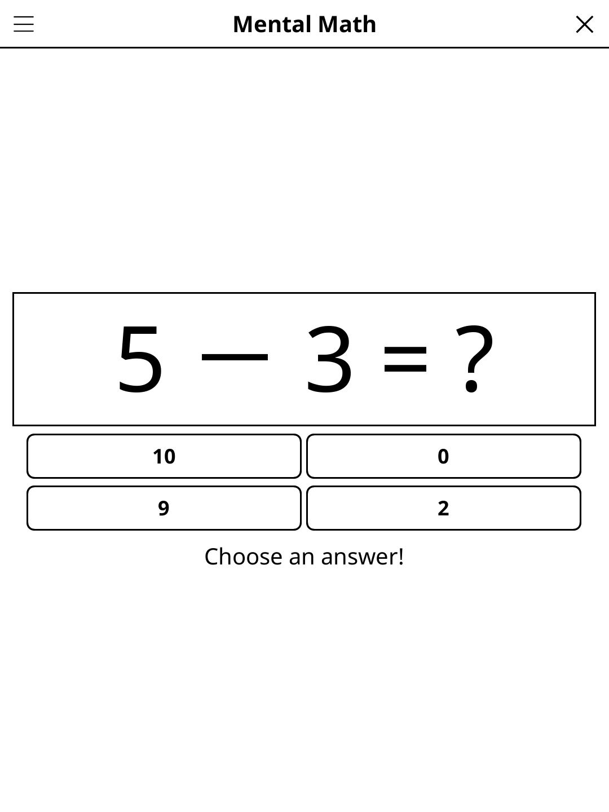

# mentalmath.koplugin

A Mental Arithmetic plugin for [KOReader](https://github.com/koreader/koreader).

## Screenshot

## Rules

Solve arithmetic equations as quickly as possible. Each exercise shows a missing value — select the correct answer from the choices provided. Operations cover addition, subtraction, multiplication, and division. Difficulty adapts to your performance.

## Features

- **Four operations** — +, −, ×, ÷
- **Multiple difficulty levels** — adjustable or auto-scaling
- **Score tracker** — records best performance
- **Auto-save** — progress saved on exit

## Installation

1. Download `mentalmath.koplugin.zip` from the [latest release](../../releases/latest).
2. Extract into the `plugins/` folder of your KOReader data directory.
3. Restart KOReader.
4. Open the menu → **Tools** → **Mental Arithmetic**.

## Controls

| Action | How |
|--------|-----|
| Select an answer | Tap the answer button |
| Change difficulty | Tap **Diff** |
| New exercise | Tap **New** |
| Show rules | Tap **Rules** |

## License

GPL-3.0 — see [LICENSE](LICENSE).
